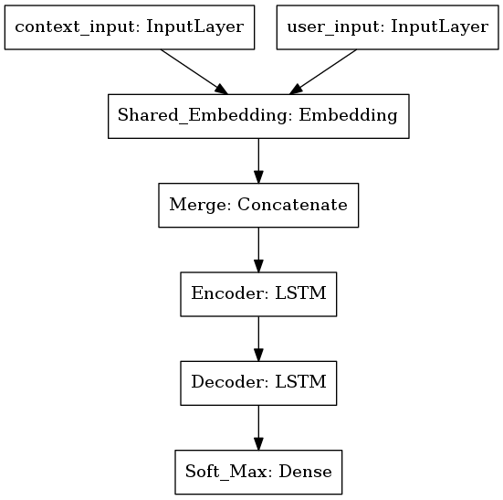
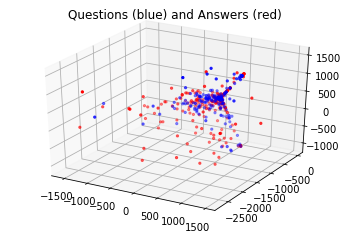

# discord-chatbot
Keras project to build a model intended for use by a Discord bot to talk to people.

# Environment
I have an amd gpu, so a docker container is provided that supports it. 

If you do not have an amd gpu, you can change what tensorflow is installed in ```requirments.py```.


# Process
The words need to be converted to tokens in order to learn on them.
I utilize Keras's tokenizer: https://keras.io/preprocessing/text/.

Note: The model cannot learn on words dynamically, words that it receives that are
unknown are given a special token. In order to learn more words the process needs to start over and the model
retrained. 

The following process depends on the contents of ```settings.toml```

1. Data is prepared by running ```python prep.py``` -> data/training/data.txt 
2. The model is created by running ```python makemodel.py``` -> produces models/production.h5
3. The model may continue to be trained by running python3 ```train.py```, trains models/production.h5

It is important to note that the tokenizer is saved along with the model in ```settings['tokenizer']['production']```

# Data
The data trained on is located in data/train/data.txt; it is specified in ```settings.toml``` under files->training.
The file consists of a list of sentences seperated by new lines. Every other sentence is a reply to the previous.

Every dataset name listed in ```settings.toml->preperation->sets``` is used as a key in ```data_preperation_procedures``` to call a function that prepares the data.

## Adding sets
1) Place the data set to its own sub folder in data/sets.
2) Add a unique name for the set in ```settings.toml->preperation->sets```.
3) Create a function that also has a unique name in ```preperation->sets``` in ```prep.py``` that parces the data.
4) Add the function name to ```data_preperation_procedures``` in prep.py as a value with the name in step 2 as the key.  

The function added in step 3 returns the data as (input sentence)\n(output sentence)\n ...
This will be summed up with the output of the other sets and consolidated in data/train/data.txt.

## Recommended sets
* chatterbot: https://www.kaggle.com/kausr25/chatterbotenglish#botprofile.yml
* NPS Chat https://www.kaggle.com/nltkdata/nps-chat

# The Model



## LSTM - (Long Short Term Memory)
This is the primary layers for the model. It helps predict the next steps with a given frequency (sentences).
I found this tutorial to be an adequate introduction: https://adventuresinmachinelearning.com/keras-lstm-tutorial/

# Analysis
## PCA


Basic sentences are clustered together but more complicated sentences fringe out.
I found that a large number of the components is required to capture 90% or more of the
information a given sentence contains. 

## Vocab representation
The Keras tokenizer can provided a wealth of information.
Ex: This snippet taken from: https://machinelearningmastery.com/prepare-text-data-deep-learning-keras/
```python3
# define 5 documents
docs = ['Well done!',
		'Good work',
		'Great effort',
		'nice work',
		'Excellent!']
# create the tokenizer
t = Tokenizer()
# fit the tokenizer on the documents
t.fit_on_texts(docs)
# summarize what was learned
print(t.word_counts)
print(t.document_count)
print(t.word_index)
print(t.word_docs)
# integer encode documents
encoded_docs = t.texts_to_matrix(docs, mode='count')
print(encoded_docs)
```
